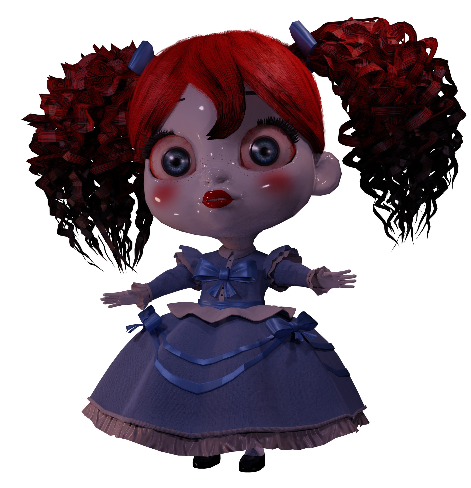
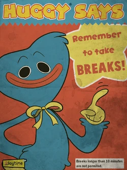

<!--
*** Thanks for checking out the Best-README-Template. If you have a suggestion
*** that would make this better, please fork the repo and create a pull request
*** or simply open an issue with the tag "enhancement".
*** Don't forget to give the project a star!
*** Thanks again! Now go create something AMAZING! :D
-->

<!-- PROJECT LOGO -->
 

  

  <h3 align="center">Poppys Toolbox</h3>

  

    Poppys Toolbox is the best (and only) speedrunning mod for glitch hunting and practicing! 
     
     
     
    <a href="https://github.com/MelloYourFello/Poppys-Toolbox/issues/new?assignees=&labels=&template=bug_report.md&title=">Report Bug</a>
    ·
    <a href="https://github.com/MelloYourFello/Poppys-Toolbox/issues/new?assignees=&labels=&template=feature_request.md&title=">Request Feature</a>
  

<!-- TABLE OF CONTENTS -->

  
Table of Contents

  <ol>
    <li><a href="#about-the-project">About The Project</a>
    <li><a href="#installation">Installation</a></li>
    <li><a href="#roadmap">Roadmap</a></li>
    <li><a href="contact">Contact</a></li>
  </ol>

<!-- ABOUT THE PROJECT -->
## About The Project

  
  

Poppy Playtime needs a speedrun mod, and is now getting one!
Poppys Toolbox is a speedrunning mod with multiple features such as: 100% toggleable god cubes, save states, god mode, console, custom commands, fly, noclip,  getbluehand, getredhand, getbothhands, LoadCheckpoint, Demos, ShowHitboxes, vhsgrab (VHS number), plugins and even more! This really is the next generation of glitchhunting.

<!-- INSTALLATION -->
## Installation

Installing Poppys Toolbox Has Never Been Easier! Just Follow These Tips Below!

1. Look at the releases on the sidebar
2. Download the .exe file
3. Run the .exe file
4. Run Poppy Playtime
5. Done!

<!-- ROADMAP -->
## Roadmap

- [ ] Add Console
- [ ] Add Plugins
- [ ] Add PlayerPosition
- [ ] Add SaveStates
- [ ] Add ShowHitboxes
- [ ] Add VHS_Grab (VHS Number)
- [ ] Add Fly
- [ ] Add Noclip
- [ ] Add LoadCheckpoint
- [ ] Add getHand (blue, red or both)
- [ ] Add Demos (records game

See the [open issues](https://github.com/MelloYourFello/Poppys-Toolbox/issues) for a full list of proposed features (and known issues).

<!-- CONTACT -->
## Contact

YourMellonianFello (AKA MelloYourFello) - [Twitch](https://www.twitch.tv/yourmellonianfello) - [Youtube](https://www.youtube.com/channel/UCQlhMd5RW3_jEkSBOQJyvvw)

randomcmd (AKA Random) - [Github](https://github.com/randomcmd)

(<a href="#top">back to top</a>)

